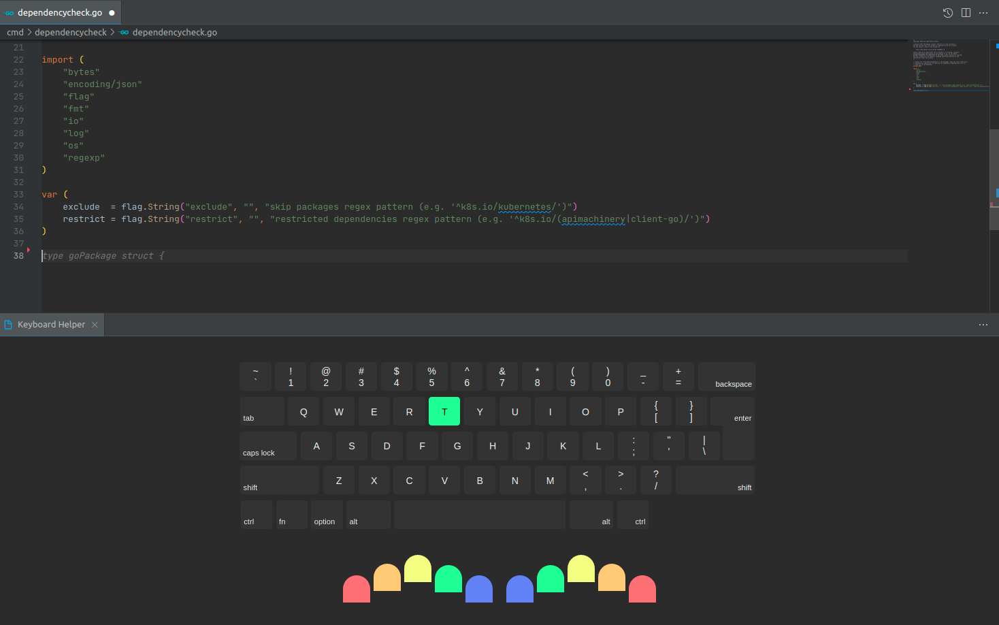

# learn-typing

**Learn typing** is vscode extension for learning to type with all 10 fingers.

## Why use this vscode extension?

- you can get familiar with syntax of languages
- you can get familiar with the code of project
- you can learn how to type with all 10 fingers

## Run extension

1. Run `npm run build` in `ui` directory
2. Open vscode with current project
3. `F5`
4. There should be open a new vscode window

## Using extension

1. `Ctrl + Shift + P`
2. Execute command - `Prepare learn typing`
3. `Ctrl + Shift + P`
4. Execute command - `Start learn typing`
5. Enjoy!!!

## Warning

Use separated clone of the project, because the `Prepare learn typing` command clears the content of files in order to do inline suggestions. You can find copy of the project in `.learn-typing` folder. This folder is used as an database to do suggestions.
